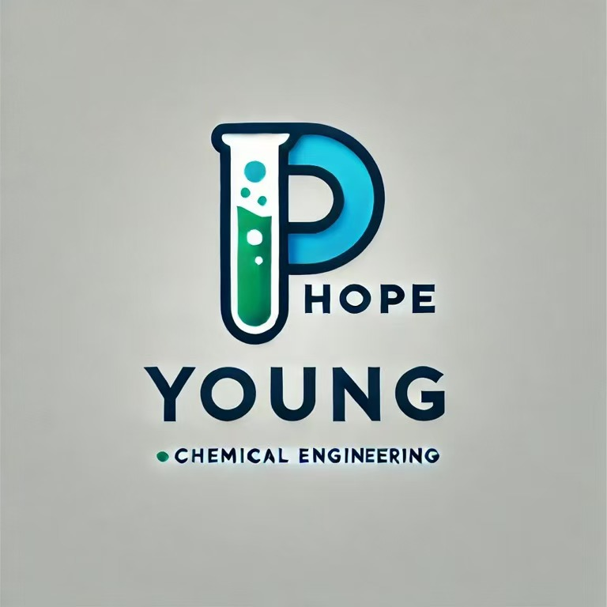

1. 销售电话：张生（13922297800）何生（18620031360）吴生（18148928019）袁小姐（18142899637）  
2. 商务邮箱：hopeyoungchem.cn   
3. 业务微信/二维码：  
  
4. 公司地址：广东省广州市天河区五山街道东莞庄路110号中创盈科赛宝科技园e栋308广州虹扬化工科技有限公司  
5. Logo文件：  
  
6. 公司简介（短版/长版）：我给你一个文件你帮我提取  
里面的1.2，其中置盈化工为我们母公司  
[新能源电池Pack全流程高集成度粘接与热防护新材料项目可行性研究报告.pdf](Attachments/DFEE7C0F-34AD-476B-A668-BDEEAB283219.pdf)  
7. 四大产品体系说明：聚丙烯酸酯；聚氨酯；聚脲；特种树脂。先搭建起来我们后续完善  
8. 团队与技术介绍：参考上面的pdf，后续再做修改  
9. 可公开资质证书：母公司是高新企业，有超过三十项专利  
10. 3个案例：后续再补充  
11. 哪些客户名可公开：后续补充  
12. 哪些TDS/SDS可公开：后续补充  
